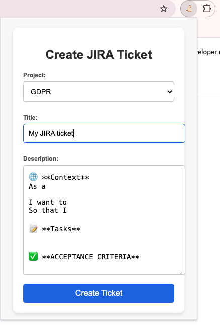

  


# JIRA Ticket Helper

A simple and customizable Chrome extension to help you create JIRA tickets quickly with predefined templates. The extension allows users to select a JIRA project, enter ticket details, and automatically generate tasks in JIRA, complete with icon support for common JIRA elements.

---

## Features

- **JIRA project selection**: Automatically populates and remembers the last selected project.
- **Icon support in descriptions**: Use shortcuts like `:bug:` or `:check:` to automatically convert text into icons or emojis in the ticket descriptions.
- **Saves JIRA credentials**: Save and retrieve JIRA URL and API tokens securely using Chrome storage.
- **Default description template**: Pre-populates ticket descriptions with a configurable default template.
- **Task creation in JIRA**: Automatically creates JIRA tasks using the JIRA API and redirects you to the newly created ticket.

---

## Prerequisites

- **JIRA account**: You will need your JIRA API token and the URL of your JIRA instance.
- **Node.js**: Must be installed on your system for development purposes.

---

## Installation

1. **Clone the repository**:
   ```bash
   git clone https://github.com/papeclem2/jira-ticket-helper.git
   cd jira-ticket-helper

2. **Install dependencies**:
   ```bash
   npm install

3. **Load the extension in Chrome**:
   - Open Chrome and navigate to `chrome://extensions/`.
   - Enable **Developer mode** (toggle in the top-right corner).
   - Click on **Load unpacked** and select the `jira-ticket-helper` folder.

---

## Usage

1. **Configure JIRA Settings**:
   - In the extension options, enter your JIRA URL and API token.
   - Save the settings, and you will be redirected to the main page of the extension.
   
2. **Create JIRA Ticket**:
   - Select your JIRA project from the dropdown (the list is automatically fetched from your JIRA instance).
   - Enter the ticket title and description (you can use shortcuts like `:bug:`, `:check:`, `:fire:`, etc.).
   - Click **Create Ticket**. The extension will automatically create a task in JIRA and open the ticket in a new tab.

---

## Usage

1. **Configure JIRA Settings**:
   - In the extension options, enter your JIRA URL and API token.
   - Save the settings, and you will be redirected to the main page of the extension.
   
2. **Create JIRA Ticket**:
   - Select your JIRA project from the dropdown (the list is automatically fetched from your JIRA instance).
   - Enter the ticket title and description (you can use shortcuts like `:bug:`, `:check:`, `:fire:`, etc.).
   - Click **Create Ticket**. The extension will automatically create a task in JIRA and open the ticket in a new tab.



---

## Contributing

Contributions are highly appreciated! To contribute:

1. **Fork the repository**.
2. **Create your feature branch**:
   ```bash
   git checkout -b feature/AmazingFeature
3. **Commit your changes**:
   ```bash
   git commit -m 'Add some AmazingFeature'
4. **Push to your branch**:
   ```bash
   git push origin feature/AmazingFeature
5. **Open a pull request**.

We welcome all kinds of improvements, bug fixes, or new features.

---

## License

This project is licensed under the MIT License - see the [LICENSE](LICENSE) file for details.

---

### Get Started and Happy Coding!
